# LocationStatus — Technical Reference

A `LocationStatus` is assigned to every `ClosedRegion` during loop
enumeration. It describes where a region sits relative to its parent's
pairing structure. The assignment depends entirely on whether the parent is
pseudoknotted and, if so, how the parent's two border pairs relate to each
other geometrically.

---
## Visualization 

---

## Definitions

Let $r = [r_i, r_j]$ be a closed region and let $p = [p_i, p_j]$ be its
parent region. Define the pair-table lookup as $\pi(k)$ — the base-pairing
partner of position $k$, or $\varnothing$ if unpaired.

A region $p$ is **pseudoknotted** if its border positions do not pair with
each other:

$$
\text{is\_pseudo}(p) \iff \pi(p_i) \neq p_j
$$

When $p$ is pseudoknotted, its two **border pairs** are:

$$
B_1 = (p_i,\ \pi(p_i)) \qquad B_2 = (\pi(p_j),\ p_j)
$$

These define two **band intervals** along the sequence:

$$
I_1 = [p_i,\ \pi(p_i)] \qquad I_2 = [\pi(p_j),\ p_j]
$$

---

## Variant 1 — `Standard`

Assigned when:

- $r$ has no parent (it is a top-level region), or
- the parent $p$ is **not** pseudoknotted, i.e. $\pi(p_i) = p_j$.

$$
\text{location}(r) = \texttt{Standard} \iff p = \varnothing \;\lor\; \pi(p_i) = p_j
$$

This is the overwhelmingly common case for nested (non-pseudoknotted)
structures. All hairpins, stacks, interior loops, and multiloops in a
plain dot-bracket structure receive `Standard`.

---

## Variant 2 — `InBand`

Assigned when the parent $p$ is pseudoknotted and $r_i$ falls inside one
of the two band intervals:

$$
\text{location}(r) = \texttt{InBand}
\iff
r_i \in I_1 \cup I_2
\iff
r_i \in [p_i,\, \pi(p_i)] \;\lor\; r_i \in [\pi(p_j),\, p_j]
$$

**When does this occur?**
In an H-type pseudoknot, the two border pairs *cross*:
$\pi(p_i) \geq \pi(p_j)$, which means $I_1$ and $I_2$ together cover the
entire interval $[p_i, p_j]$ with no gap. Every child of a crossing-border
pseudoknot is therefore `InBand`.

**Example** — H-type pseudoknot `((([[[)))...]]]`:

$$
p = (0, 14), \quad \pi(0) = 8, \quad \pi(14) = 3
$$

$$
I_1 = [0, 8], \quad I_2 = [3, 14]
$$

A child region $(9, 11)$ has $r_i = 9$. Since $9 \in [0, 8]$... wait —
$9 \notin [0,8]$ but $9 \in [3, 14]$, so the child is `InBand` via $I_2$.

---

## Variant 3 — `OutBand`

Assigned when the parent $p$ is pseudoknotted and $r_i$ falls in the
**gap** between the two band intervals:

$$
\text{location}(r) = \texttt{OutBand}
\iff
r_i \notin I_1 \cup I_2
\iff
\pi(p_i) < r_i < \pi(p_j)
$$

This gap only exists when the border pairs are **nested** rather than
crossing:

$$
\pi(p_i) < \pi(p_j) \quad \Longrightarrow \quad \text{gap } (\pi(p_i),\, \pi(p_j)) \neq \varnothing
$$

**When does this occur?**
In kissing-loop structures, the outermost closed region has border pairs
that do not cross each other. The two band intervals $I_1$ and $I_2$ leave
a real gap in the middle, and any child whose $r_i$ falls in that gap is
`OutBand`.

**Example** — kissing loop with parent $(0, 21)$, $\pi(0) = 9$,
$\pi(21) = 12$:

$$
I_1 = [0, 9], \quad I_2 = [12, 21]
$$

Since $\pi(p_i) = 9 < 12 = \pi(p_j)$, the gap is $(9, 12)$.
A child $(10, 11)$ has $r_i = 10 \in (9, 12)$, so it is `OutBand`.

---

## Variant 4 — `SpanBand`

`SpanBand` is **not** produced by `location_status`. It is assigned
separately by `enumerate_band_spanning_loops`, which runs after the main
loop classification for each pseudoknotted region.

A band of a pseudoknotted region is a maximal helix — a sequence of
consecutively stacked base pairs forming one arm of the pseudoknot. Let a
band have rungs ordered outer to inner:

$$
(b_0,\ \pi(b_0)),\ (b_1,\ \pi(b_1)),\ \ldots,\ (b_{m-1},\ \pi(b_{m-1}))
$$

where $b_0 < b_1 < \cdots < b_{m-1}$ are the left-arm positions.

For each consecutive rung pair $(b_k, \pi(b_k))$ and $(b_{k+1}, \pi(b_{k+1}))$,
a **SpanBand loop** is emitted with:

$$
\text{closing} = (b_k,\ \pi(b_k))
\qquad
\text{inner} = (b_{k+1},\ \pi(b_{k+1}))
$$

The number of unpaired bases on each side is:

$$
n_5 = b_{k+1} - b_k - 1
\qquad
n_3 = \pi(b_k) - \pi(b_{k+1}) - 1
$$

The loop type follows the standard interior-loop classification:

$$
\text{loop type} = \begin{cases}
\texttt{Stack}    & n_5 = 0 \text{ and } n_3 = 0 \\
\texttt{Bulge}    & n_5 = 0 \text{ xor } n_3 = 0 \\
\texttt{Interior} & n_5 > 0 \text{ and } n_3 > 0
\end{cases}
$$

If other closed regions have their closing pairs strictly between two
consecutive rungs, the loop is classified as `Multiloop` instead.

**Example** — H-type pseudoknot `((([[[)))...]]]`, Round band
$[b_0, b_1, b_2] = [0, 1, 2]$:

$$
\text{closing} = (0, 8), \quad \text{inner} = (1, 7)
$$

$$
n_5 = 1 - 0 - 1 = 0, \qquad n_3 = 8 - 7 - 1 = 0
$$

$$
\Longrightarrow \quad \texttt{Stack},\ \texttt{SpanBand}
$$

The same calculation repeats for $(1,7) \to (2,6)$ in the Round band and
for both consecutive rung pairs in the Square band, yielding four
`SpanBand` loops total for this structure.

---

## Summary table

| Variant | Condition | Produced by |
|---|---|---|
| `Standard` | No parent, or parent not pseudoknotted | `location_status` |
| `InBand` | $r_i \in I_1 \cup I_2$, parent pseudoknotted | `location_status` |
| `OutBand` | $r_i \notin I_1 \cup I_2$, parent pseudoknotted | `location_status` |
| `SpanBand` | Loop between consecutive band rungs | `enumerate_band_spanning_loops` |

The key invariant: `InBand` and `OutBand` are mutually exclusive and
exhaustive for children of a pseudoknotted parent. `OutBand` can only
arise when $\pi(p_i) < \pi(p_j)$ — i.e. when the border pairs are nested
rather than crossing. In the common H-type pseudoknot where
$\pi(p_i) \geq \pi(p_j)$, $I_1 \cup I_2 = [p_i, p_j]$ and every child
is `InBand`.