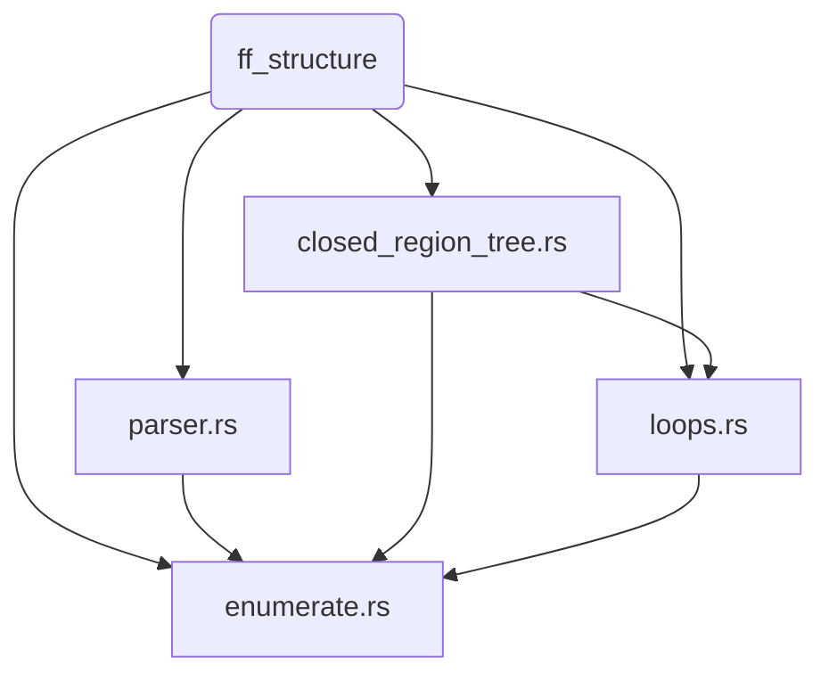

# Pseudoknots Module — Technical Reference

> **Crate:** `ff_energy::pseudoknots`  
> **Reference:** Rastegari & Condon, *Effective Band Decomposition for Pseudoknotted RNA*

---

## Table of Contents

1. [Overview](#overview)
2. [Dependency Graph](#dependency-graph)
3. [External Types from `ff_structure`](#external-types-from-ff_structure)
4. [Module: `parser.rs`](#module-parserrs)
5. [Module: `closed_region_tree.rs`](#module-closed_region_treers)
6. [Module: `loops.rs`](#module-loopsrs)
7. [Module: `enumerate.rs`](#module-enumeraters)
8. [Algorithms](#algorithms)
9. [End-to-end Example](#end-to-end-example)

---

## Overview

This module decomposes an RNA secondary structure — given as an extended
dot-bracket string — into a classified list of **loops**. It handles both
standard nested structures and **pseudoknots**: base pairs that cross each
other and cannot be represented by nested parentheses alone.

The pipeline has four stages, each in its own file:

```
&str
  │
  ▼  parser.rs
PairTable
  │
  ▼  closed_region_tree.rs
RegionTree
  │
  ▼  loops.rs  (types consumed by next stage)
LoopType, Loop, LocationStatus, ClosingDescriptor
  │
  ▼  enumerate.rs
Vec<Loop>
```

The distinction from `ff_structure`'s own `PairTable::try_from(&str)` is
intentional: this module's parser is **strict** — it rejects strand-break
characters (`+`/`&`), because the loop enumeration algorithm assumes a single
contiguous RNA molecule. Multi-strand complexes are handled elsewhere via
`StrandPairTable`/`MultiPairTable`.

---

## Dependency Graph



Each arrow represents a direct `use` dependency. `ff_structure` is the only
external crate dependency — all four modules import `PairTable`,
`ExtendedDotBracketVec`, `BracketKind`, `ExtendedDotBracket`, and
`StructureError` from it.

---

## External Types from `ff_structure`

These types are defined in `ff_structure` and used throughout this module.
They are documented here for reference.

### `NAIDX` — `type NAIDX = u16`

A type alias for nucleic-acid indices. Used as the value type inside
`PairTable`. Because it is an alias (not a newtype), `NAIDX` and `u16` are
interchangeable to the compiler; rust-analyzer will display `u16` in inferred
types.

### `PairTable` — `struct PairTable(Vec<Option<NAIDX>>)`

A flat, 0-indexed array representation of RNA secondary structure.

- `pt[i] == Some(j)` means position `i` is base-paired with position `j`.
- `pt[i] == None` means position `i` is unpaired.
- By construction, `pt[i] == Some(j)` implies `pt[j] == Some(i)` (symmetry).
- Self-pairing (`pt[i] == Some(i)`) is impossible by construction.

Supports indexing by both `usize` and `NAIDX`. Created via:

```rust
PairTable::new(n)              // all-None, length n
PairTable::try_from("((...))")?  // parse from extended dot-bracket string
```

### `ExtendedDotBracket` — enum

A single token in extended dot-bracket notation.

| Variant | Characters | Meaning |
|---|---|---|
| `Unpaired` | `.` | Unpaired nucleotide |
| `Break` | `+`, `&` | Strand break (multi-strand) |
| `Open(BracketKind)` | `(`, `[`, `{`, `<`, `A`–`D` | Opening bracket |
| `Close(BracketKind)` | `)`, `]`, `}`, `>`, `a`–`d` | Closing bracket |

### `BracketKind` — enum

The pairing family of a bracket, ordered by conventional pseudoknot nesting
level.

| Variant | Open | Close |
|---|---|---|
| `Round` | `(` | `)` |
| `Square` | `[` | `]` |
| `Curly` | `{` | `}` |
| `Angle` | `<` | `>` |
| `UpperA` | `A` | `a` |
| `UpperB` | `B` | `b` |
| `UpperC` | `C` | `c` |
| `UpperD` | `D` | `d` |

### `ExtendedDotBracketVec` — `struct ExtendedDotBracketVec(pub Vec<ExtendedDotBracket>)`

A tokenized sequence of `ExtendedDotBracket` variants. Mirrors `DotBracketVec`
in design: the inner field is public to allow direct manipulation, but
well-formedness is only guaranteed when constructed via `TryFrom`.

The standard parsing pipeline for this module is:

```
&str  →  DotBracketVec         →  PairTable   (simple, permissive)
&str  →  ExtendedDotBracketVec →  PairTable   (pseudoknots, strict)
```

---

## Module: `parser.rs`

**Public API:** `extended_dot_bracket_to_pair_table`

### Purpose

Converts a pre-tokenized `&[ExtendedDotBracket]` (typically the dereferenced
contents of an `ExtendedDotBracketVec`) into a `PairTable`. This is the
**strict** entry point for the pseudoknot pipeline: it explicitly rejects
`Break` tokens, enforcing the single-molecule assumption required by
`enumerate_loops`.

### Differences from `PairTable::try_from(&str)`

| | `PairTable::try_from(&str)` | `extended_dot_bracket_to_pair_table` |
|---|---|---|
| Input | raw `&str` | pre-tokenized `&[ExtendedDotBracket]` |
| `Break` (`+`/`&`) | silently ignored (treated as unpaired) | rejected with `InvalidToken` error |
| Intended use | general-purpose | pseudoknot loop decomposition only |

### Algorithm

Maintains one stack per `BracketKind` in a `HashMap<BracketKind, Vec<NAIDX>>`.

```
for each token at index i:
    Unpaired  → skip
    Break     → error (InvalidToken)
    Open(k)   → push i onto stacks[k]
    Close(k)  → pop j from stacks[k]
                  if stack empty → error (UnmatchedClose)
                  else pt[i] = j, pt[j] = i

after loop:
    for each kind k:
        if stacks[k] non-empty → error (UnmatchedOpen at stacks[k][0])
```

Because each `BracketKind` has its own independent stack, brackets of
different kinds never interfere — this is what allows pseudoknot notation
like `([)]` to be parsed correctly (the `(` and `[` stacks are separate).

### Signature

```rust
pub fn extended_dot_bracket_to_pair_table(
    edb: &[ExtendedDotBracket],
) -> Result<PairTable, StructureError>
```

---

## Module: `closed_region_tree.rs`

**Public API:** `ClosedRegion`, `RegionTree`, `ClosingDescriptor`,
`build_closed_regions_tree`, `is_pseudo`, `closing_pairs`,
`closing_descriptor`, `LocationStatus`, `location_status`,
`collect_bands`, `nested_pairs`

### `ClosedRegion` — struct

A node in the closed-regions tree. A *closed region* is a maximal interval
`[i, j]` such that every base pair with one endpoint inside the interval has
both endpoints inside the interval.

```rust
pub struct ClosedRegion {
    pub i: usize,           // 0-based left endpoint
    pub j: usize,           // 0-based right endpoint
    pub parent: Option<usize>,   // None = top-level (parent is the implicit root)
    pub children: Vec<usize>,    // arena indices of child regions
}
```

`parent == None` replaces the Python reference implementation's
`parent.is_root` sentinel. In Python, the root was represented as a real
`ClosedRegion(-1, n)` object; here it is implicit — there is no node for it
in the arena.

### `RegionTree` — struct

An arena-based tree of `ClosedRegion`s. Every region is stored by index in
`nodes: Vec<ClosedRegion>`; parent/child relationships are represented as
`usize` indices into this vector.

```rust
pub struct RegionTree {
    pub nodes: Vec<ClosedRegion>,   // arena; not every index is reachable from top_level
    pub n: usize,                   // length of the structure
    pub top_level: Vec<usize>,      // indices of root's direct children, sorted by i
}
```

**Note on orphaned arena entries:** During pseudoknot interval merging
(Algorithm 1, Case 2), regions are popped from the construction stack and
discarded without being attached to the tree. These remain in `nodes` as
unreachable entries — the exact counterpart of Python's garbage-collected
objects in the same situation. Traversal always starts from `top_level` and
is unaffected.

### `ClosingDescriptor` — enum

The closing pair(s) of a region, typed. A non-pseudoknotted region has one
closing pair; a pseudoknotted region has two crossing border pairs.

```rust
pub enum ClosingDescriptor {
    Single((usize, usize)),                       // one closing base pair (i, j)
    Double((usize, usize), (usize, usize)),       // two crossing pairs: (i, pt[i]), (pt[j], j)
}
```

This is the Rust equivalent of Python's dynamic return type from
`_closing_descriptor`, which returned either a `(i, j)` tuple or a
`((i,j),(i',j'))` tuple depending on a runtime length check.

### `LocationStatus` — enum

Where a region sits relative to its parent's pairing structure. Assigned
during loop enumeration.

| Variant | Meaning |
|---|---|
| `Standard` | Parent is not pseudoknotted, or region is top-level |
| `InBand` | Parent is pseudoknotted; region lies within one of parent's two bands |
| `OutBand` | Parent is pseudoknotted; region lies in the gap between bands |
| `SpanBand` | Region spans a band rung; assigned by `enumerate_band_spanning_loops`, not `location_status` |

### Helper functions

#### `is_pseudo`

```rust
pub fn is_pseudo(region: &ClosedRegion, pt: &PairTable) -> bool
```

A region is pseudoknotted if its border positions `i` and `j` do not pair
with each other: `pt[i] != Some(j)`. This covers both the case where `pt[i]`
is `None` and where `pt[i]` pairs with some other position.

#### `closing_pairs`

```rust
pub fn closing_pairs(region: &ClosedRegion, pt: &PairTable) -> Vec<(usize, usize)>
```

Returns the closing pair(s) of a region:

- Non-pseudoknotted: `vec![(i, j)]`
- Pseudoknotted: `vec![(i, pt[i]), (pt[j], j)]` — the two crossing border pairs

#### `closing_descriptor`

```rust
pub fn closing_descriptor(region: &ClosedRegion, pt: &PairTable) -> ClosingDescriptor
```

Wraps `closing_pairs` into a `ClosingDescriptor`. Used when building
`Loop.closing` and `Loop.children`.

#### `location_status`

```rust
pub fn location_status(
    region: &ClosedRegion,
    parent: Option<&ClosedRegion>,
    pt: &PairTable,
) -> LocationStatus
```

`parent == None` (top-level region) → `Standard`.  
Parent not pseudoknotted → `Standard`.  
Parent pseudoknotted: checks whether `region.i` falls within the parent's
two band intervals `[pi, pt[pi]]` or `[pt[pj], pj]`:

- If yes → `InBand`
- If no → `OutBand` (only possible when border pairs are nested, not crossing,
  e.g. kissing loops)

#### `collect_bands`

```rust
pub fn collect_bands(
    tree: &RegionTree,
    region: &ClosedRegion,
    pt: &PairTable,
) -> Vec<Vec<usize>>
```

Implements Algorithm 2 (Band-Finding) from Rastegari & Condon. Returns a list
of *chains* — each chain is the left-arm positions of one band, ordered
outer → inner. Returns empty if `region` is not pseudoknotted.

See [Band-Finding Algorithm](#band-finding-algorithm-2) for details.

#### `nested_pairs`

```rust
pub fn nested_pairs(
    tree: &RegionTree,
    children: &[usize],
    pt: &PairTable,
    left: usize,
    right: usize,
) -> Vec<(usize, usize)>
```

Returns the closing pairs of all children whose interval `[c.i, c.j]` lies
**strictly** inside `(left, right)`. Used by `enumerate_band_spanning_loops`
to detect whether other closed regions sit between two consecutive band rungs.

---

## Module: `loops.rs`

**Public API:** `LoopType`, `Loop`, `interior_loop_type`

### `LoopType` — enum

The seven loop categories from Rastegari & Condon's classification.

| Variant | Description |
|---|---|
| `Stack` | Two adjacent base pairs with no unpaired bases between them |
| `Hairpin` | A closing pair with only unpaired bases inside |
| `Bulge` | One unpaired base on exactly one side between two pairs |
| `Interior` | Unpaired bases on both sides between two pairs |
| `Multiloop` | A closing pair with two or more nested closing pairs inside |
| `External` | The outermost loop; has no closing pair |
| `Pseudoloop` | A pseudoknotted closed region's main loop |

### `Loop` — struct

A single loop in the decomposed structure.

```rust
pub struct Loop {
    pub loop_type:   LoopType,
    pub location:    LocationStatus,
    pub closing:     Option<ClosingDescriptor>,   // None only for External
    pub inner:       Option<(usize, usize)>,      // Stack/Bulge/Interior only
    pub children:    Vec<ClosingDescriptor>,      // Multiloop/Pseudoloop/External
    pub unpaired_5p: usize,                       // unpaired bases on 5' side
    pub unpaired_3p: usize,                       // unpaired bases on 3' side
}
```

Built with a fluent builder pattern:

```rust
Loop::new(LoopType::Interior, LocationStatus::Standard)
    .with_closing(ClosingDescriptor::Single((1, 12)))
    .with_inner((4, 9))
    .with_unpaired(2, 2)
```

### `interior_loop_type`

```rust
pub fn interior_loop_type(
    closing: (usize, usize),
    inner: (usize, usize),
) -> (LoopType, usize, usize)
```

Classifies the region between a closing pair `(ci, cj)` and a strictly nested
inner pair `(ii, ij)`.

```
n5 = ii - ci - 1      (unpaired bases on 5' side)
n3 = cj - ij - 1      (unpaired bases on 3' side)

(0, 0) → Stack
(0, _) or (_, 0) → Bulge
(_, _) → Interior
```

Returns `(LoopType, n5, n3)`.

---

## Module: `enumerate.rs`

**Public API:** `enumerate_band_spanning_loops`, `enumerate_loops`,
`parse_structure`

### `enumerate_band_spanning_loops`

```rust
pub fn enumerate_band_spanning_loops(
    tree: &RegionTree,
    region: &ClosedRegion,
    pt: &PairTable,
    loops: &mut Vec<Loop>,
) 
```

For each pair of consecutive rungs in each band of `region`, emits one loop
with `location = SpanBand`:

- If no other closed regions sit in the gaps between the rungs →
  `interior_loop_type` classifies it as `Stack`, `Bulge`, or `Interior`.
- If other closed regions do sit in the gaps → `Multiloop`.

### `enumerate_loops`

```rust
pub fn enumerate_loops(tree: &RegionTree, pt: &PairTable) -> Vec<Loop>
```

The main traversal. Visits every region in **post-order** (children before
parent), then appends one `Loop` per region according to this classification:

```
is_pseudo     → Pseudoloop
0 children    → Hairpin
1 non-pseudo child → Stack / Bulge / Interior  (via interior_loop_type)
otherwise     → Multiloop
```

After visiting all regions, appends one `External` loop whose children are
the closing descriptors of all top-level regions.

After classifying each region, calls `enumerate_band_spanning_loops` to emit
any additional `SpanBand` loops for that region's bands.

**Note on `visit`:** Rust closures cannot call themselves recursively without
extra indirection. `visit` is therefore a plain recursive `fn` taking
`&RegionTree` explicitly, rather than a closure capturing the tree.

### `parse_structure`

```rust
pub fn parse_structure(s: &str) -> Result<Vec<Loop>, StructureError>
```

The public entry point. Runs the full pipeline:

```rust
let edbv = ExtendedDotBracketVec::try_from(s)?;      // tokenize; rejects Break
let pt   = extended_dot_bracket_to_pair_table(&edbv)?; // build PairTable
let tree = build_closed_regions_tree(&pt);              // build RegionTree
Ok(enumerate_loops(&tree, &pt))                         // enumerate loops
```

---

## Algorithms

### Algorithm 1 — Build Closed Regions Tree

**Source:** Rastegari & Condon, Algorithm 1. Adapted to 0-based indexing and
an arena representation.

**Input:** `PairTable` of length `n`  
**Output:** `RegionTree` with `top_level` as the implicit root's children

A running index `lam` sweeps left to right over the pair table. A stack
tracks open (started but not yet closed) regions.

```
for lam in 0..n:

  Case 1 — Opening bracket: pt[lam] = b, lam < b
      push ClosedRegion(lam, b) onto stack

  Case 2 — Closing bracket: pt[lam] = b, b < lam
      e = lam
      while stack.top().i > b:           ← pseudoknot crossing detected
          e = max(e, stack.pop().j)       ← absorb crossing region's extent
      if stack non-empty:
          stack.top().j = max(stack.top().j, e)  ← extend enclosing region

  Case 3 — Check for region completion (after Cases 1/2):
      if stack.top().j == lam:
          add_to_tree(stack.pop())
```

**`add_to_tree(region)`** moves any currently top-level regions with
`i > region.i` to become children of `region`, then makes `region`
top-level. This is how the nesting hierarchy is built incrementally without
knowing the full tree in advance.

**Pseudoknot handling:** In Case 2, when a closing bracket is encountered
whose partner `b` is to the left of the current stack top's `i`, the
intervening regions are popped and absorbed into a larger merged interval.
This merging is what causes pseudoknotted base pairs to produce a single
`ClosedRegion` with `pt[i] != j` — i.e., `is_pseudo` returns `true`.

### Algorithm 2 — Band-Finding

**Source:** Rastegari & Condon, Algorithm 2 (§3.2 stacking relation).

**Input:** A pseudoknotted `ClosedRegion`, `RegionTree`, `PairTable`  
**Output:** A list of chains; each chain is the left-arm positions of one
band, ordered outer → inner

**Step 1 — Build BL**

`BL` is the list of paired positions in `[region.i, region.j]` that are:
- not inside any nested child region's interval, and
- not a closing pair of any nested child region.

These are the positions that belong to the pseudoknot's own base pairs,
excluding anything already accounted for by children.

**Step 2 — Walk BL, partitioning into bands**

Starting from the leftmost left-arm position in `BL`, build a chain by
repeatedly checking whether the next position in `BL` pairs with the previous
position from the right:

```
outer pair: (bi, pt[bi])
while Next(bi', BL) == bp(Prev(bj', BL)):
    step inward: bi' = Next(bi', BL), bj' = Prev(bj', BL)
    append bi' to chain
```

Each chain represents one helical band of the pseudoknot. After completing a
chain, resume from `Next(inner_left_arm, BL)` to find the next band.

The `pos` map (`HashMap<usize, usize>`) gives O(1) access to the index of any
position within `BL`, enabling the `Next`/`Prev` operations without linear
search.

---

## End-to-end Example

### Input: H-type pseudoknot `((([[[)))...]]]`

```
Position:  0  1  2  3  4  5  6  7  8  9 10 11 12 13 14
Character: (  (  (  [  [  [  )  )  )  .  .  .  ]  ]  ]
pt[i]:     8  7  6  14 13 12  2  1  0  .  .  .  5  4  3
```

**Step 1 — `parser.rs`**

Produces a `PairTable` where positions 0–2 pair with 8–6 (Round brackets) and
positions 3–5 pair with 14–12 (Square brackets).

**Step 2 — `closed_region_tree.rs`**

Algorithm 1 runs left to right:

- `lam=0..5`: push `ClosedRegion(0,8)`, `(1,7)`, `(2,6)`, `(3,14)`, `(4,13)`, `(5,12)` onto stack.
- `lam=6`: `pt[6]=2 < 6` — Case 2. Stack top is `(5,12)`, `5 > 2`: pop, `e=max(6,12)=12`. Stack top is `(4,13)`, `4 > 2`: pop, `e=max(12,13)=13`. Stack top is `(3,14)`, `3 > 2`: pop, `e=max(13,14)=14`. Stack top is `(2,6)`, `2 == 2`: stop. Extend: `(2,6).j = max(6,14) = 14`.
- `lam=6`: Case 3. Stack top `(2,6→14).j=14 ≠ 6`: no completion.
- `lam=7,8`: similar Case 2 processing, extending `(1,7)` and `(0,8)` to `j=14`.
- `lam=14`: `pt[14]=3`, Case 2, then Case 3 closes `(0,8→14)` → `add_to_tree`.

Result: a single top-level `ClosedRegion(0, 14)` with no children and
`pt[0]=8 ≠ 14`, so `is_pseudo` returns `true`.

**Step 3 — `loops.rs` / `enumerate.rs`**

`visit(0, 14)`:
- `is_pseudo = true`
- `closing_pairs` → `[(0, 8), (3, 14)]`
- `collect_bands` → `[[0, 1, 2], [3, 4, 5]]`  (two 3-rung bands)
- Emits `Pseudoloop` with `closing = Double((0,8),(3,14))`, `children = [Single((2,6)), Single((5,12))]`
- `enumerate_band_spanning_loops` emits 4 `Stack` loops (one per consecutive rung pair in each band), all with `location = SpanBand`

Final `External` loop: `children = [Double((0,8),(3,14))]`

**Final output** (`Vec<Loop>`, 6 entries):

```
Loop(Pseudoloop, closing=((0,8),(3,14)), children=[(2,6),(5,12)])
Loop(Stack, SpanBand, closing=(0,8), inner=(1,7))
Loop(Stack, SpanBand, closing=(1,7), inner=(2,6))
Loop(Stack, SpanBand, closing=(3,14), inner=(4,13))
Loop(Stack, SpanBand, closing=(4,13), inner=(5,12))
Loop(External, children=[((0,8),(3,14))])
```
